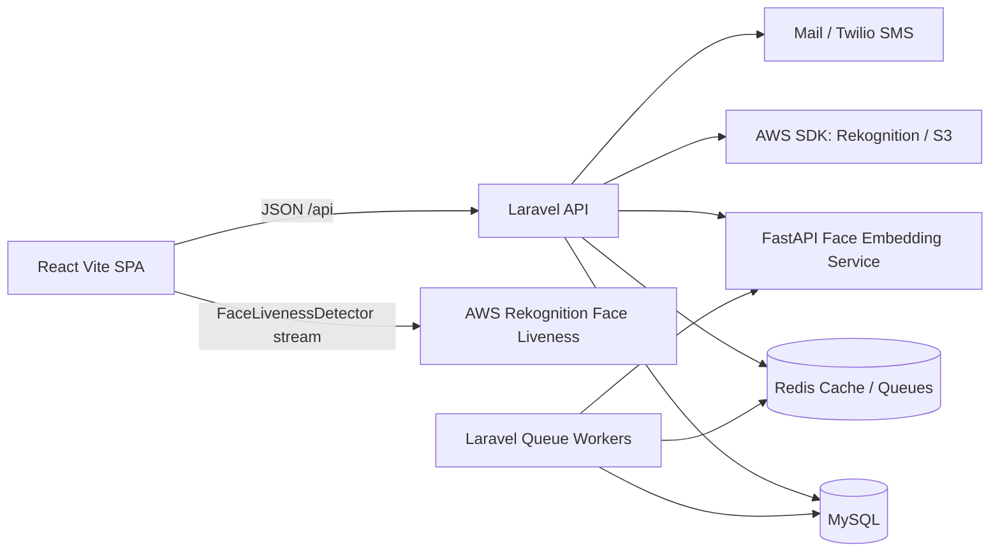
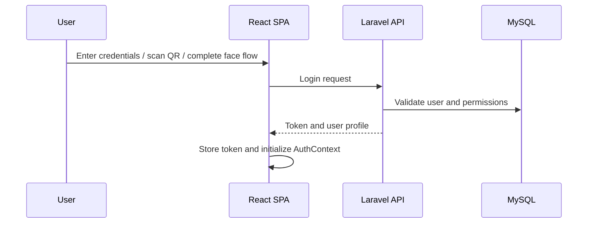
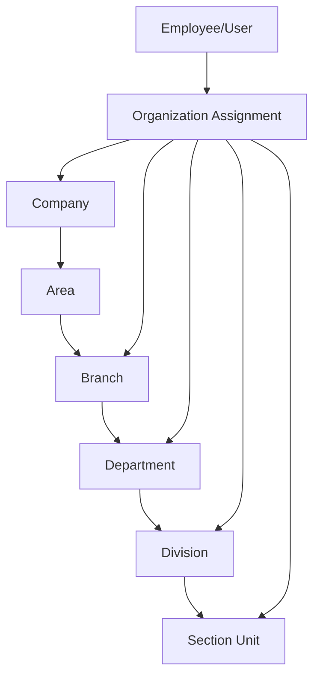
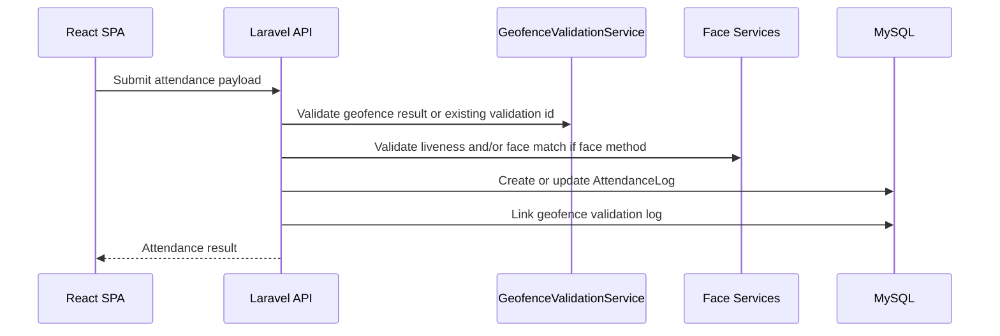
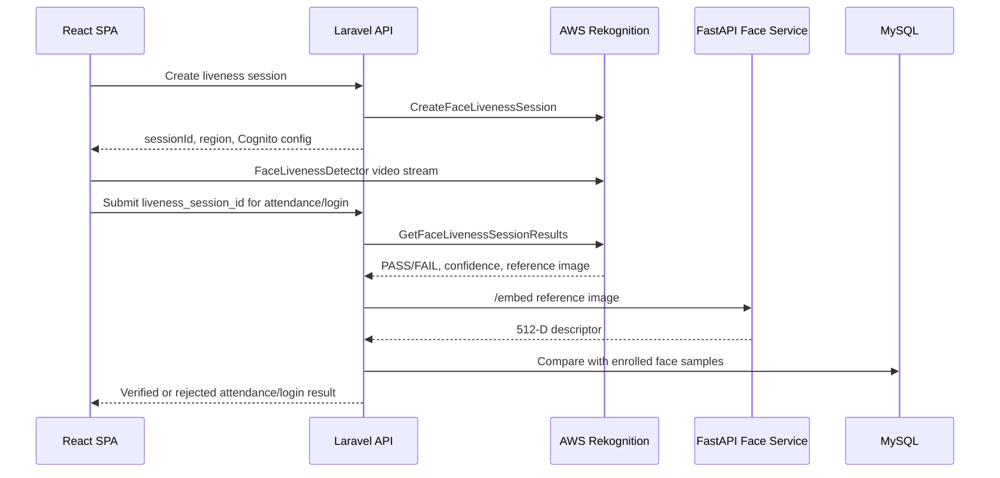
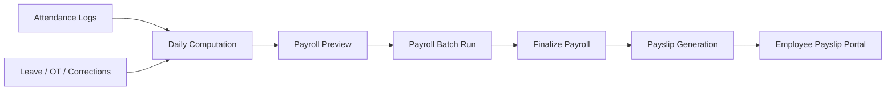

# HRIS Design Document

## 1. Purpose

This document describes the design of the HRIS application in this repository. It is intended for developers, maintainers, deployers, and reviewers who need to understand how the system is structured, how the major HR modules interact, and where important behavior lives in the codebase.

The system is a full-stack Human Resource Information System for employee self-service, HR administration, attendance monitoring, geofencing, face-verified DTR, payroll, leaves, overtime, schedules, payslips, reports, and role-based organization management.

## 2. Design Goals

- Provide a single HR platform for employees, HR administrators, and organization heads.
- Support secure attendance with QR, face recognition, geofence validation, and Amazon Rekognition Face Liveness.
- Keep payroll computation auditable through daily logs, batch previews, finalization, payslip generation, and statutory contribution handling.
- Support organization-scoped access for company, branch, department, division, and section heads.
- Keep high-cost work, such as payroll batches, payslip PDFs, reports, and face registration, on queues.
- Allow deployment locally, under an XAMPP/Laragon subpath, or behind production hosting such as CloudFront and Amplify Hosting.
- Keep the React SPA and Laravel API separated but able to run as same-origin paths in production.

## 3. System Context



The browser never performs payroll, authorization, or final attendance decisions. The frontend captures user intent, device/location data, and liveness session IDs, then Laravel validates and persists the outcome.

## 4. Technology Stack

### Frontend

| Area | Technology |
| --- | --- |
| Framework | React 19 |
| Build tool | Vite 7 |
| Routing | React Router 7 |
| Server state | TanStack Query |
| Tables | TanStack Table |
| Styling | Tailwind CSS 4, Radix UI, local UI components |
| Forms and validation | Local validation helpers, Zod |
| Maps and geofencing UI | MapLibre GL, Turf |
| Liveness UI | AWS Amplify UI FaceLivenessDetector |
| Scanner and QR | ZXing, qrcode.react |
| Charts and exports | Recharts, ExcelJS |

Important paths:

- `frontend/src/main.jsx`
- `frontend/src/App.jsx`
- `frontend/src/AuthenticatedRoutes.jsx`
- `frontend/src/api.js`
- `frontend/src/layouts/HrPanelLayout.jsx`
- `frontend/src/layouts/EmployeeDashboardLayout.jsx`
- `frontend/src/routes/hrPanelChildRoutes.jsx`
- `frontend/src/routes/employeeChildRoutes.jsx`
- `frontend/src/config/rbacNav.js`

### Backend

| Area | Technology |
| --- | --- |
| Framework | Laravel 12 |
| Language | PHP 8.2+ |
| Auth | Laravel Sanctum |
| ORM | Eloquent |
| Queues | Laravel queue workers, Redis recommended |
| Cache | Laravel cache, Redis recommended |
| PDF | DomPDF, Browsershot, TCPDF, FPDI |
| Cloud integrations | AWS SDK for PHP |
| SMS | Twilio SDK |
| Tests | PHPUnit |

Important paths:

- `backend/routes/api.php`
- `backend/bootstrap/app.php`
- `backend/config/rbac.php`
- `backend/config/attendance.php`
- `backend/config/services.php`
- `backend/config/payroll.php`
- `backend/app/Http/Controllers`
- `backend/app/Services`
- `backend/app/Jobs`
- `backend/app/Models`

### Face Embedding Service

The Python service is focused on embedding extraction, not liveness. Liveness is handled by AWS Rekognition Face Liveness.

| Area | Technology |
| --- | --- |
| API | FastAPI |
| Runtime | Uvicorn |
| Face detector and recognizer | ONNX Runtime, InsightFace ArcFace |
| Main output | 512-dimensional face descriptor |

Important paths:

- `face_service/main.py`
- `face_service/README.md`
- `face_service/requirements.txt`

## 5. Repository Layout

```text
HR/
├── DESIGN.md
├── README.md
├── backend/
│   ├── app/
│   ├── bootstrap/
│   ├── config/
│   ├── database/
│   ├── routes/
│   └── tests/
├── frontend/
│   ├── public/
│   └── src/
└── face_service/
```

## 6. Runtime Architecture

### Frontend Runtime

The frontend is a Vite SPA. It can be served by the Vite dev server, a static host, Amplify Hosting, S3, or any web server that can serve the built `dist/` output.

The SPA uses:

- `BrowserRouter` with a basename derived from `import.meta.env.BASE_URL`.
- A centralized API layer in `frontend/src/api.js`.
- `AuthContext` for authenticated user/session state.
- `NotificationsContext` for notification state.
- `ThemeContext` for light/dark mode.
- `HrAppPathContext` and `useHrBasePath` for resolving admin, company, branch, department, and employee panel paths.

### Backend Runtime

Laravel exposes JSON APIs under `/api`. The bootstrap config enables:

- API routing through `backend/routes/api.php`.
- Sanctum stateful API support for cookie/CSRF SPA deployments.
- Middleware aliases:
  - `admin`
  - `super.admin`
  - `hr.panel`
  - `permission`

The backend is responsible for authentication, authorization, data scoping, validation, payroll computation, attendance writes, geofence decisions, liveness result checks, and audit logs.

### Worker Runtime

Queue workers handle long-running or heavy operations:

- Face registration
- Payroll generation
- Payroll finalization
- Payslip generation
- Bulk payslip ZIPs
- Detailed report exports
- Mail and SMS delivery
- Bulk approval follow-up work

Redis is recommended for production queues and cache.

## 7. Frontend Design

### Entry Points

| Concern | File |
| --- | --- |
| App bootstrap | `frontend/src/main.jsx` |
| Root public routes | `frontend/src/App.jsx` |
| Authenticated route tree | `frontend/src/AuthenticatedRoutes.jsx` |
| HR panel child routes | `frontend/src/routes/hrPanelChildRoutes.jsx` |
| Employee child routes | `frontend/src/routes/employeeChildRoutes.jsx` |

`App.jsx` hosts the public flows such as login, QR/kiosk attendance, password reset, and lazy-loaded authenticated routes.

`AuthenticatedRoutes.jsx` protects the HR panel and employee panel. It maps organization-head aliases such as `/company`, `/branch`, and `/department` onto the shared HR panel child route set.

### API Client

`frontend/src/api.js` centralizes:

- API base URL resolution.
- Sanctum CSRF bootstrapping.
- Bearer token storage and clearing.
- Authenticated fetch wrappers.
- Public fetch wrappers.
- Attendance geolocation helpers.
- Geofence validation helpers.
- Liveness session helpers.
- Payroll, leave, overtime, payslip, geofence, and admin API calls.

The default API base is same-origin `/api`, which supports CloudFront or a reverse proxy routing `/api/*` to Laravel.

### Layouts

| Layout | Purpose |
| --- | --- |
| `HrPanelLayout.jsx` | HR admin and organization-head panel shell |
| `EmployeeDashboardLayout.jsx` | Employee self-service shell |

The HR panel layout provides a base path context so the same components can work under `/admin`, `/company`, `/branch`, `/department`, and related organization-scoped routes.

### Frontend Module Areas

| Area | Example files |
| --- | --- |
| Dashboard | `AdminDashboard.jsx`, `EmployeeDashboard.jsx` |
| Employees | `AdminEmployees.jsx`, `AdminEmployeeProfile.jsx` |
| Organization | `AdminCompanies.jsx`, branch/department/division pages |
| Attendance | `AdminAttendance.jsx`, `EmployeeAttendance.jsx` |
| Geofencing | `AdminGeofencing.jsx` |
| Face liveness | `FaceRekognitionLiveness.jsx` |
| Leave | `AdminLeave.jsx`, employee leave pages |
| Overtime | `OvertimeRequests.jsx`, admin overtime pages |
| Schedules | `AdminSchedules.jsx`, `MySchedule.jsx` |
| Payroll | pay cycles, pay components, daily computation, generate/finalize pages |
| Payslips | `PayslipsListPage.jsx`, `AdminPayslipViewPage.jsx` |
| RBAC | `AdminUsersPermissions.jsx` |
| Reports | `AdminReports.jsx` |

## 8. Backend Design

### Routing

`backend/routes/api.php` is the main route registry.

Route groups:

- Public auth and recovery routes
- Public liveness session routes
- Kiosk attendance routes
- Authenticated employee routes
- Authenticated HR panel routes
- Permission-gated admin routes

Examples:

- `POST /api/login`
- `POST /api/login/qr`
- `POST /api/login/face`
- `POST /api/face/liveness/session`
- `POST /api/attendance/geofence/validate`
- `POST /api/attendance`
- `GET /api/admin/dashboard`
- `GET /api/admin/geofencing`
- `POST /api/admin/branches/{id}/geofences`
- `PATCH /api/admin/branches/{branchId}/geofences/{geofenceId}`
- `DELETE /api/admin/branches/{branchId}/geofences/{geofenceId}`

### Controllers

Controllers are split into public/employee-facing controllers and admin controllers.

| Controller area | Responsibility |
| --- | --- |
| `AuthController` | Login, logout, QR login, face login, current user |
| `AttendanceController` | Clock in/out, QR scan, kiosk scan, face scan |
| `LivenessController` | Rekognition Face Liveness session and result endpoints |
| `EmployeeProfileController` | Employee self-service profile |
| `EmployeeLeaveController` | Employee leave application |
| `EmployeeOvertimeController` | Employee overtime requests |
| `EmployeePayslipController` | Employee payslip list/view/download |
| `Admin/*Controller` | HR panel administration modules |

### Services

The backend keeps complex domain logic in services rather than controllers.

| Service group | Examples |
| --- | --- |
| Authorization and scope | `RbacService`, `DataScopeService`, `HrRoleResolver` |
| Attendance and face | `GeofenceValidationService`, `FaceVerificationService`, `FaceAuthService`, `RekognitionLivenessService` |
| Payroll | `PayrollComputationService`, `PayrollRulesEngineService`, `FinalizePayrollService`, `PayslipService` |
| Leave and overtime | `LeaveCreditService`, `LeaveApprovalService`, `OvertimeService`, `OvertimePayrollService` |
| Organization | `OrganizationLeadershipService`, `EmployeeOrganizationAssignmentService` |
| Approvals | `HrApprovalChainResolver`, `ApprovalWorkflowSettingService` |
| Deductions and loans | `DeductionApplicationService`, `LoanAmortizationService`, `RemittanceService` |

### Jobs

Jobs are used for operations that should not block user requests:

- `ProcessFaceRegistrationJob`
- `GeneratePayrollBatchJob`
- `FinalizePayrollJob`
- `GeneratePayslipsJob`
- `BulkPayslipPdfJob`
- `GenerateDetailedReportCsvJob`
- SMS and notification jobs

## 9. Authentication and Authorization Design

### Authentication

The system uses Laravel Sanctum. The frontend supports:

- Bearer token authentication.
- Optional Sanctum stateful session and CSRF flow.
- QR login.
- Face login with Rekognition liveness.

Primary auth data flow:



### HR Roles

The HR role model separates normal employees from HR panel users and organization heads.

Typical hierarchy:

- `admin_hr`
- `company_head`
- `area_head`
- `branch_head`
- `department_head`
- `division_head`
- `section_unit_head`
- `employee`

Organization-head roles are resolved from assignments and leadership records.

### Permission Slugs

Fine-grained capabilities are configured in `backend/config/rbac.php` and enforced by the `permission` middleware.

Examples:

- `dashboard.view`
- `attendance.view`
- `geofence.view`
- `geofence.create`
- `geofence.update`
- `geofence.delete`
- `employees.view`
- `payroll.view`
- `payslip.view`
- `rbac.manage`

The frontend mirrors these permissions in navigation and route guards, but the backend remains the source of truth.

### Data Scope

`DataScopeService` limits organization-head access to their assigned company, branch, department, division, or section/unit scope. This prevents org heads from accessing unrelated employees or records even when they share the same UI module.

## 10. Organization Model

The HRIS models both company structure and assignment scope.



Organization design supports:

- Employee assignment to a structure.
- Head assignment and approval routing.
- Data scoping by organization.
- Branch-based geofencing.
- Payroll and attendance grouping.

## 11. Attendance Design

Attendance supports multiple input paths:

- Employee clock-in/out while authenticated.
- Kiosk QR attendance.
- Kiosk face attendance.
- Face login.
- Manual correction or presence filing.

### Attendance Recording Flow



### Geofencing

Branch geofences support:

- Circle or polygon shapes.
- Per-device scope such as all devices, desktop/laptop, mobile/tablet, or specific device type.
- Accuracy threshold per geofence.
- Branch-level geofence settings.
- Enforcement modes.
- Validation logs.

Important files:

- `frontend/src/pages/AdminGeofencing.jsx`
- `backend/app/Http/Controllers/Admin/GeofenceController.php`
- `backend/app/Services/GeofenceValidationService.php`
- `backend/app/Models/BranchGeofence.php`
- `backend/app/Models/GeofenceValidationLog.php`

### Face Liveness and Recognition

Face attendance uses two separate checks:

1. Liveness: Amazon Rekognition Face Liveness through Amplify UI.
2. Identity match: backend retrieves the Rekognition reference image, asks the Python service for an embedding, then compares it against enrolled vectors.



Important files:

- `frontend/src/components/FaceRekognitionLiveness.jsx`
- `backend/app/Http/Controllers/LivenessController.php`
- `backend/app/Services/RekognitionLivenessService.php`
- `backend/app/Services/FaceVerificationService.php`
- `backend/app/Services/FaceAuthService.php`
- `face_service/main.py`

## 12. Payroll Design

Payroll is designed as a pipeline:



### Payroll Responsibilities

| Stage | Responsibility |
| --- | --- |
| Daily computation | Convert attendance, schedules, leave, OT, and corrections into payroll-ready daily records |
| Preview | Show computed gross pay, deductions, statutory values, and net pay before finalization |
| Batch generation | Create payroll batch records for a period |
| Finalization | Lock results and persist final payroll state |
| Payslip generation | Produce employee-facing payslips and PDFs |
| Unlocking | Allow controlled demotion of finalized periods when permitted |

Important files:

- `backend/app/Http/Controllers/Admin/PayrollController.php`
- `backend/app/Http/Controllers/Admin/PayrollFinalizeController.php`
- `backend/app/Services/PayrollComputationService.php`
- `backend/app/Services/PayrollRulesEngineService.php`
- `backend/app/Services/FinalizePayrollService.php`
- `backend/app/Services/PayslipService.php`
- `frontend/src/pages/AdminGeneratePayslipsPage.jsx`
- `frontend/src/pages/AdminFinalizePayrollPage.jsx`
- `frontend/src/components/payslips/PayslipsListPage.jsx`

## 13. Leave, Overtime, Schedules, and Approvals

### Leave

Leave supports:

- Employee application.
- Document upload.
- Half-day and undertime previews.
- Paid leave preview.
- Admin review.
- Bulk approval and rejection.
- Leave credit tracking.

### Overtime

Overtime supports:

- Employee request filing.
- Admin review and export.
- Bulk approval and rejection.
- Payroll integration.
- Philippine overtime rule handling.

### Schedules

Schedules support:

- Admin schedule templates.
- Assignment to employees.
- Employee schedule change requests.
- Approval and rejection by authorized users.

### Approval Chains

Approval behavior is driven by organization leadership and workflow settings. This allows approvals to route through company, branch, department, division, or section leadership depending on the module and employee assignment.

Important files:

- `backend/app/Services/HrApprovalChainResolver.php`
- `backend/app/Services/ApprovalWorkflowSettingService.php`
- `backend/app/Http/Controllers/Admin/ApprovalWorkflowSettingsController.php`
- `backend/app/Services/LeaveApprovalService.php`
- `backend/app/Services/AttendanceCorrectionApprovalService.php`

## 14. Employee Self-Service Design

Employees can access:

- Dashboard summary.
- Attendance and DTR.
- QR and face registration.
- Leave filing.
- Overtime filing.
- Schedule requests.
- Profile updates.
- Documents and certifications.
- Payslips and salary history.
- Loans and deductions.
- Notifications and reports.

The self-service API is scoped to the authenticated employee unless permission middleware grants broader access.

## 15. Admin and Organization Head Design

Admin HR users can manage the full HRIS. Organization heads can access HR panel modules but are scoped to their organization subtree.

Admin/HR panel modules include:

- Dashboard
- Employee management
- Companies, areas, branches, departments, divisions, section units
- Attendance monitoring
- Geofencing
- Attendance corrections
- Holidays
- Schedules
- Leave
- Overtime
- Payroll
- Payslips
- Reports
- User permissions
- Approval workflow settings
- Regularization

## 16. Data Model Overview

Major model groups:

| Group | Representative models |
| --- | --- |
| Identity | `User`, `Permission`, `RolePermission` |
| Organization | `Company`, `Area`, `Branch`, `Department`, `Division`, `SectionUnit` |
| Employee profile | employee documents, skills, certifications, government IDs |
| Attendance | `AttendanceLog`, `GeofenceValidationLog`, `BranchGeofence` |
| Face | face descriptors, recognition attempts, failed attempts |
| Leave | `LeaveRequest`, leave credits |
| Overtime | `Overtime`, overtime payroll records |
| Schedules | schedules, schedule requests |
| Payroll | payroll periods, batch runs, daily logs, payslips |
| Compensation | pay cycles, pay components, deductions, loans |
| Notifications | notifications and module counts |

The database is migration-driven under `backend/database/migrations`.

## 17. Security Design

### Server-Side Controls

- Sanctum authentication for protected APIs.
- Permission middleware for module actions.
- HR panel middleware for organization-head/admin access.
- Data scoping for org-head visibility.
- Backend validation for all create/update/delete operations.
- Geofence validation before attendance persistence.
- Liveness verification before face attendance/login acceptance.
- Queue-based processing for expensive and sensitive background jobs.

### Client-Side Controls

- Protected routes.
- Permission-aware navigation.
- Auth context and token clearing on expired sessions.
- UI feedback for location, liveness, and attendance states.

Client-side controls improve UX but do not replace backend authorization.

### Sensitive Data

Do not commit:

- `.env`
- AWS credentials
- Cognito IDs if not intended public
- SMS/mail secrets
- Database credentials
- Production private files

## 18. Deployment Design

### Local Development

Typical local services:

- Laravel API at `http://127.0.0.1:8000`
- Vite frontend at `http://localhost:5173`
- FastAPI face service at `http://127.0.0.1:5000`
- MySQL
- Redis for cache/queues

### Production

Recommended production concerns:

- Serve the frontend build from a static host or Amplify Hosting.
- Route `/api/*` and `/sanctum/*` to Laravel.
- Disable caching for API and Sanctum paths.
- Use HTTPS everywhere.
- Use Redis for queues and cache.
- Run dedicated queue workers.
- Keep several warm face service instances if kiosk traffic is high.
- Configure CloudFront if using a CDN for the SPA and API edge routing.
- Keep AWS Rekognition Face Liveness and Cognito Identity Pool in `us-east-1` or `us-east-2`.

CloudFront can improve SPA and API delivery, but the actual Rekognition liveness stream still goes directly from the browser to AWS Rekognition.

### Environment Variables

Important backend settings:

- `APP_URL`
- `DB_*`
- `CACHE_STORE`
- `QUEUE_CONNECTION`
- `SESSION_DRIVER`
- `SANCTUM_STATEFUL_DOMAINS`
- `CORS_ALLOWED_ORIGINS`
- `FACE_VERIFICATION_URL`
- `FACE_VERIFICATION_URLS`
- `AWS_ACCESS_KEY_ID`
- `AWS_SECRET_ACCESS_KEY`
- `REKOGNITION_REGION`
- `COGNITO_IDENTITY_POOL_ID`
- `COGNITO_REGION`

Important frontend settings:

- `VITE_API_URL`
- `VITE_BASE`
- `VITE_USE_SANCTUM_SESSION`
- `VITE_AWS_REGION`
- `VITE_COGNITO_IDENTITY_POOL_ID`

## 19. Performance Design

Performance is handled through:

- Lazy-loaded route modules.
- Centralized request timeouts and retry behavior for safe GET requests.
- Redis-backed queues for heavy work.
- Multiple warm face embedding services for concurrent clock-in/out.
- Cached liveness session results.
- Precomputed or cached face embedding data where supported.
- Backend services that separate payroll computation from controller logic.

Potential future improvements:

- Split large frontend chunks with more dynamic imports.
- Add manual Rollup chunking for heavy libraries such as maps, PDF, liveness, and reports.
- Add observability around queue duration and liveness latency.
- Add API response caching for safe, role-scoped lookup endpoints.

## 20. Observability and Diagnostics

Current diagnostic patterns include:

- Laravel logs for geofence, face liveness, AWS failures, and timeout context.
- Frontend toast/error states for geolocation, liveness, and attendance.
- Queue job status endpoints for some async operations.
- Health endpoint for the face service.
- Laravel `/up` health route.

Recommended production additions:

- Centralized log collection.
- Queue dashboard such as Horizon or equivalent monitoring.
- Metrics for API latency, liveness creation latency, geofence validation time, face service latency, and payroll job duration.
- Alerting for failed queues and face service health.

## 21. Testing and Verification

Existing verification commands:

```bash
cd frontend
npm run lint
npm run build
```

```bash
cd backend
php artisan test
php artisan config:clear
```

Focused backend areas already have tests around geofence validation. New changes should add tests when they touch:

- Geofence rules.
- Attendance recording.
- Face liveness and matching contracts.
- Payroll calculations.
- Leave/overtime approval logic.
- RBAC and data scope behavior.

## 22. Design Boundaries

### Frontend Should Own

- User interaction.
- Route rendering.
- Form state.
- Map drawing UI.
- Liveness component rendering.
- Client-side validation and helpful feedback.

### Backend Should Own

- Authentication.
- Authorization.
- Data scope.
- Payroll calculations.
- Attendance validity.
- Geofence decisions.
- Liveness result validation.
- Face identity matching.
- Persistence.
- Auditing.

### Python Face Service Should Own

- Model loading.
- Face detection and alignment.
- Embedding extraction.
- Legacy verification compatibility endpoints.

It should not decide attendance, liveness, or authorization.

## 23. Important File Index

| Concern | Path |
| --- | --- |
| Root setup | `README.md` |
| Frontend entry | `frontend/src/main.jsx` |
| Root routes | `frontend/src/App.jsx` |
| Authenticated routes | `frontend/src/AuthenticatedRoutes.jsx` |
| API client | `frontend/src/api.js` |
| HR panel layout | `frontend/src/layouts/HrPanelLayout.jsx` |
| Employee layout | `frontend/src/layouts/EmployeeDashboardLayout.jsx` |
| HR route config | `frontend/src/routes/hrPanelChildRoutes.jsx` |
| Employee route config | `frontend/src/routes/employeeChildRoutes.jsx` |
| Face liveness UI | `frontend/src/components/FaceRekognitionLiveness.jsx` |
| Geofencing UI | `frontend/src/pages/AdminGeofencing.jsx` |
| Laravel routes | `backend/routes/api.php` |
| Laravel bootstrap | `backend/bootstrap/app.php` |
| RBAC config | `backend/config/rbac.php` |
| Attendance config | `backend/config/attendance.php` |
| Liveness controller | `backend/app/Http/Controllers/LivenessController.php` |
| Attendance controller | `backend/app/Http/Controllers/AttendanceController.php` |
| Geofence controller | `backend/app/Http/Controllers/Admin/GeofenceController.php` |
| Geofence service | `backend/app/Services/GeofenceValidationService.php` |
| Rekognition service | `backend/app/Services/RekognitionLivenessService.php` |
| Face verification | `backend/app/Services/FaceVerificationService.php` |
| Payroll service | `backend/app/Services/PayrollComputationService.php` |
| Payroll finalization | `backend/app/Services/FinalizePayrollService.php` |
| Face service | `face_service/main.py` |

## 24. Maintenance Notes

- Keep frontend route permissions aligned with `backend/config/rbac.php`.
- Keep admin and organization-head route behavior aligned with `DataScopeService`.
- Keep geofence frontend payloads aligned with `GeofenceController` validation rules.
- Keep face liveness frontend payloads aligned with `LivenessController`.
- Keep payroll UI terminology aligned with payroll service outputs.
- Keep `.env.example` updated when new deployment requirements are introduced.
- Avoid committing generated local caches such as `frontend/.vite/`.

